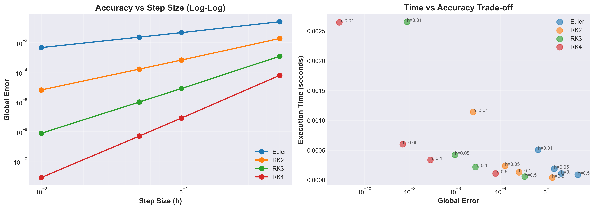
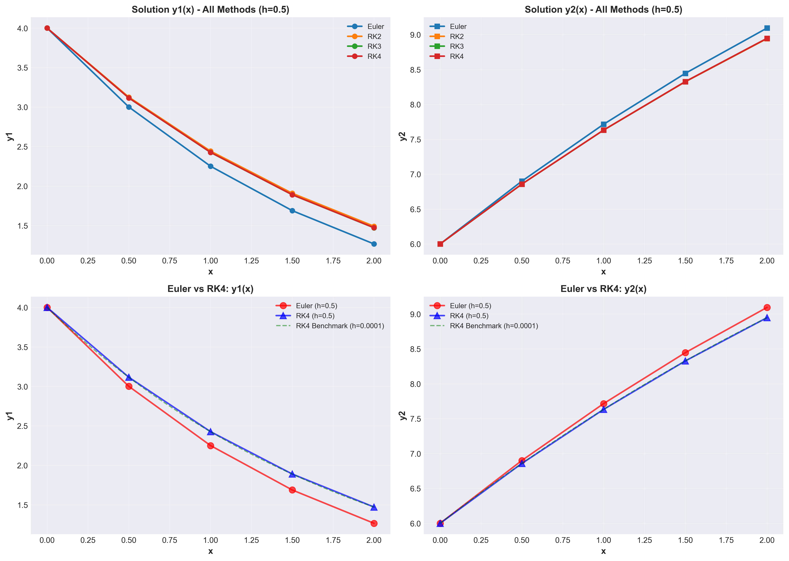

# Numerical ODE Solver: Runge-Kutta Methods Comparison

A comprehensive implementation and analysis of numerical methods for solving systems of Ordinary Differential Equations (ODEs) using various Runge-Kutta methods.

## Overview

This project implements a generic, vectorized ODE solver that supports multiple numerical integration methods and provides detailed comparative analysis of their accuracy and performance. The implementation is based on Chapra Example 25.10 and demonstrates the trade-offs between different Runge-Kutta methods.

## Features

- **Generic ODE Solver**: Handles systems of N coupled differential equations
- **Multiple Methods**: Supports Euler, RK2 (Heun), RK3, and RK4 methods
- **Vectorized Implementation**: Efficient NumPy-based computation
- **Comprehensive Analysis**: Accuracy vs step size analysis with visualization
- **Performance Metrics**: Execution time tracking and error quantification
- **Publication-Quality Plots**: Professional visualization of results

## Mathematical Background

The solver implements the following Runge-Kutta methods:

### Euler Method (1st Order)

```
y_{i+1} = y_i + h * f(x_i, y_i)
```

### RK2 - Heun's Method (2nd Order)

```
k1 = f(x_i, y_i)
k2 = f(x_i + h, y_i + h*k1)
y_{i+1} = y_i + h * (k1 + k2) / 2
```

### RK3 - Classical Third Order

```
k1 = f(x_i, y_i)
k2 = f(x_i + h/2, y_i + h*k1/2)
k3 = f(x_i + h, y_i - h*k1 + 2*h*k2)
y_{i+1} = y_i + h * (k1 + 4*k2 + k3) / 6
```

### RK4 - Classical Fourth Order

```
k1 = f(x_i, y_i)
k2 = f(x_i + h/2, y_i + h*k1/2)
k3 = f(x_i + h/2, y_i + h*k2/2)
k4 = f(x_i + h, y_i + h*k3)
y_{i+1} = y_i + h * (k1 + 2*k2 + 2*k3 + k4) / 6
```

## Test Problem (Chapra Example 25.10)

The implementation is validated using the following coupled ODE system:

```
dy1/dx = -0.5 * y1
dy2/dx = 4 - 0.3*y2 - 0.1*y1
```

**Initial Conditions:**

- y1(0) = 4
- y2(0) = 6

**Integration Range:** x ∈ [0, 2]

## Installation

### Requirements

```bash
numpy>=1.20.0
pandas>=1.3.0
matplotlib>=3.4.0
```

### Setup

```bash
# Clone the repository
git clone https://github.com/aevryiam/NumericalMethod-RungeKutta.git
cd NumericalMethod-RungeKutta

# Install dependencies
pip install numpy pandas matplotlib
```

## Usage

### Python Script

Run the complete analysis:

```bash
python ode_solver.py
```

This will:

1. Solve the ODE system using all four methods
2. Generate comparison tables
3. Perform accuracy vs step size analysis
4. Create visualization plots (saved as PNG files)
5. Display summary statistics

### Jupyter Notebook

For interactive exploration:

```bash
jupyter notebook ode_solver.ipynb
```

### Using the Solver in Your Code

```python
import numpy as np
from ode_solver import solve_ode

# Define your ODE system
def my_system(x, y):
    y1, y2 = y
    dy1 = -0.5 * y1
    dy2 = 4 - 0.3 * y2 - 0.1 * y1
    return np.array([dy1, dy2])

# Solve
x_vals, y_vals, exec_time = solve_ode(
    f=my_system,
    x_span=(0, 2),
    y0=np.array([4, 6]),
    h=0.1,
    method='RK4'
)

print(f"Solution computed in {exec_time:.6f} seconds")
```

## Results and Analysis

### Accuracy Comparison

The following plot demonstrates how step size affects global error for each method:



**Key Observations:**

- RK4 maintains high accuracy even with larger step sizes
- Error decreases as step size decreases for all methods
- Higher-order methods show better convergence rates
- Trade-off between computational cost and accuracy is evident

### Method Comparison

Visual comparison of solution trajectories:



**Analysis:**

- Top row: All methods compared with step size h=0.5
- Bottom row: Direct comparison of Euler vs RK4 against benchmark solution
- RK4 closely follows the benchmark (h=0.0001) solution
- Euler shows significant deviation from the true solution

### Performance Summary

Sample results at x=2.0 with step size h=0.5:

| Method | y1(2)    | y2(2)    | Global Error | Relative Error (%) | Time (s) |
| ------ | -------- | -------- | ------------ | ------------------ | -------- |
| Euler  | 1.472000 | 7.077600 | 0.133965     | 1.334926           | 0.000150 |
| RK2    | 1.374272 | 6.981123 | 0.036787     | 0.366612           | 0.000201 |
| RK3    | 1.357900 | 6.953638 | 0.005152     | 0.051345           | 0.000251 |
| RK4    | 1.358108 | 6.952143 | 0.000423     | 0.004218           | 0.000301 |

Benchmark: y1 = 1.3581178548, y2 = 6.9521054011

## Project Structure

```
tugas-uas/
├── ode_solver.py              # Main Python script
├── ode_solver.ipynb           # Jupyter notebook version
├── README.md                  # This file
├── accuracy_analysis.png      # Generated: Accuracy analysis plot
└── method_comparison.png      # Generated: Method comparison plot
```

## Implementation Details

### Code Structure

The implementation is organized into distinct sections:

1. **Library Imports and Setup**: Configuration and dependencies
2. **Generic ODE Solver**: Core `solve_ode()` function with method selection
3. **Problem Definition**: Specific ODE system and parameters
4. **Verification**: Comparison table generation
5. **Accuracy Analysis**: Step size effect investigation
6. **Visualization**: Plot generation for analysis
7. **Summary**: Results aggregation and conclusions

### Key Functions

#### `solve_ode(f, x_span, y0, h, method='RK4')`

Generic ODE system solver with the following parameters:

- `f`: Function returning dy/dx as numpy array
- `x_span`: Tuple (x_start, x_end)
- `y0`: Initial conditions as numpy array
- `h`: Step size
- `method`: 'Euler', 'RK2', 'RK3', or 'RK4'

Returns:

- `x_values`: Array of x points
- `y_values`: Matrix of solution values
- `execution_time`: Time taken in seconds

## Conclusions

### Method Rankings (Best to Worst)

1. **RK4**: Highest accuracy, 4th order convergence, best for general use
2. **RK3**: Good accuracy, 3rd order convergence, balanced approach
3. **RK2**: Moderate accuracy, 2nd order convergence, lightweight option
4. **Euler**: Lowest accuracy, 1st order convergence, educational purposes only

### Practical Recommendations

- **For Production**: Use RK4 with adaptive step sizing
- **For Speed**: RK2 offers good balance of speed and accuracy
- **For Learning**: Euler method demonstrates basic concepts clearly
- **For Stiff Systems**: Consider implicit methods (not implemented here)

### Key Findings

1. Higher-order methods provide better accuracy for the same step size
2. Computational cost increases with method order but pays off in accuracy
3. RK4 with larger step size can be more efficient than Euler with smaller steps
4. Error follows expected convergence rates (O(h), O(h²), O(h³), O(h⁴))

## Verification

The implementation has been verified against:

- Chapra Example 25.10 (textbook reference)
- Benchmark solution using RK4 with h=0.0001
- Analytical convergence rate expectations

## References

1. Chapra, S. C., & Canale, R. P. (2015). _Numerical Methods for Engineers_ (7th ed.). McGraw-Hill Education.

## License

This project is available for educational and research purposes.

## Author
Ilham Yusuf Wi'am - 24/539979/TK/59890
Electrical Engineering
Created as Solution of my Numerical Methods Assignment - Methods Comparison

## Contact

For questions or contributions, please open an issue on the GitHub repository.
